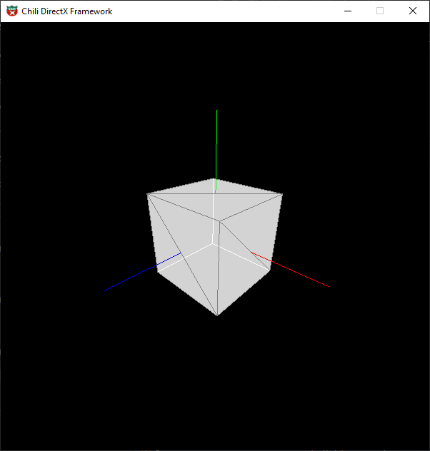
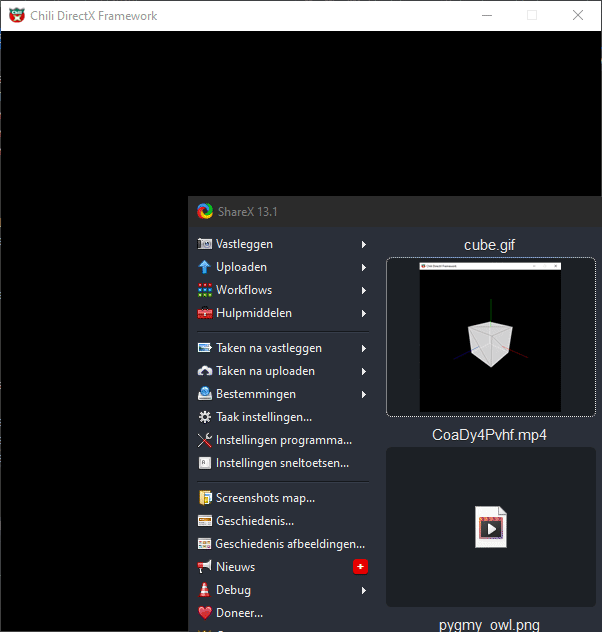
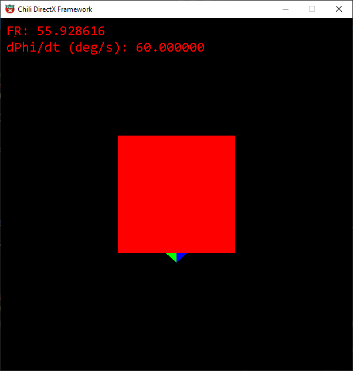
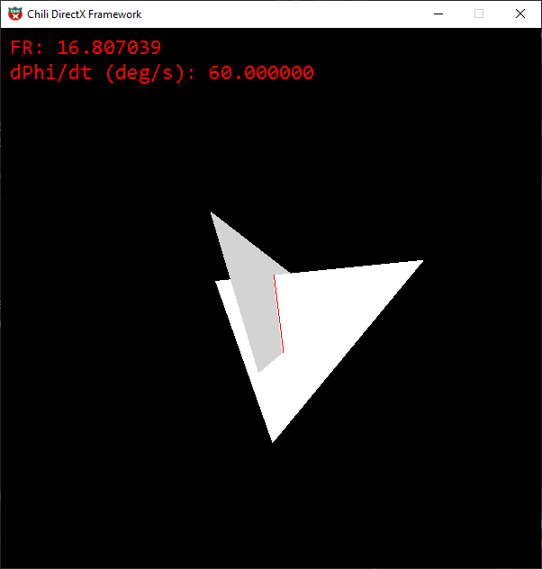
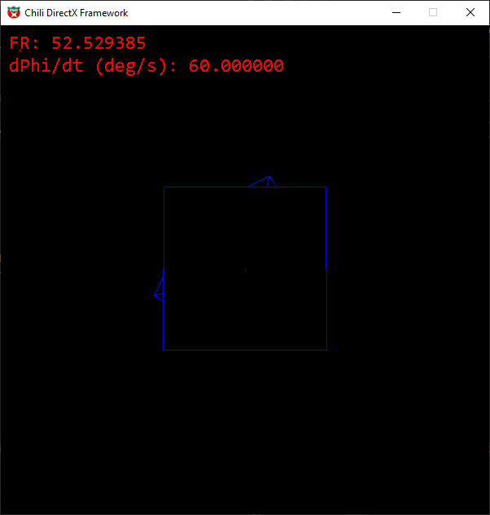

# 3D_Fundamentals

Building a 3d rendering pipeline. Following Chili tutorials 3d Fundamentals 

Stage: Backface culling, independent rotations  

Stage: Texture mapping (with clamping, wrapping of textures) 

Stage: Added pixel shader to the pipeline (templated function object for flexibility in rendering effects) 

Stage: Z-buffer added 

Stage: Triangle Intersection rendering
(Own implementation of "A Fast Triangle-Triangle Intersection Test" by Tomas Moeller) 

Applying triangle intersection rendering to other shapes 

