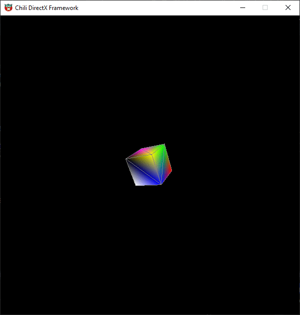

# 3D_Fundamentals

Building a 3d rendering pipeline
Following Chili tutorials 3d Fundamentals

Stage: Backface culling, independent rotations

Stage: Texture mapping (with clamping, wrapping of textures)

Stage: Added pixel shader to the pipeline (templated function object for flexibility in rendering effects)

Stage: Z-buffer added

